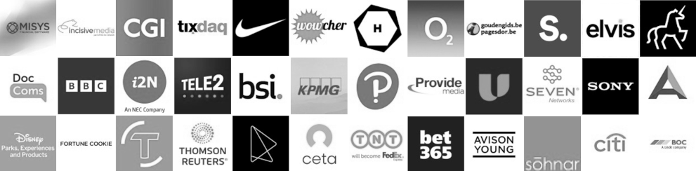

I’m **Paul Littlebury**, a quality engineer and tester with more than 25 years of experience. I help teams ship better software through smarter testing, stronger automation, and a more human approach to quality.

I believe quality is not something to just add at the end of delivery. It is a mindset, a culture, and a way of working. Done right, it improves reliability, boosts delivery confidence, and elevates the experience of the people using the product.

## What I do & How I help

I blend hands-on engineering with collaborative problem-solving across five core areas:

*   **Test engineering:** Testing for web, mobile, APIs, and performance.
*   **DevOps & CI/CD:** Building robust, maintainable frameworks and embedding testing into pipelines.
*   **Accessibility:** Treating inclusive UX and accessibility as a first-class quality concern.
*   **Strategy & coaching:** Helping teams take shared ownership of quality and user-centred thinking.
*   **Conversational AI:** Exploring and testing complex AI systems to uncover issues early.

I love bringing order to complex systems so teams can feel genuinely confident in their releases.

## Experience

I have worked across healthcare, fintech, telecoms, public services, and high-traffic consumer products. Highlights include:

*   **Acorn Compliance** — Focused on conversational AI quality and automation frameworks.
*   **bet365** — Rebuilt mobile UI and API test frameworks for Android and iOS.
*   **CGI** — Led as SDET Lead across four Scrum teams working on a major Flutter banking app.
*   **Ceta Insurance** — Shaped test strategy, UI/API automation, load testing, and CI pipelines.
*   **Tele2** — Delivered quality engineering for a custom AI chatbot.
*   **Enterprise Systems** — Scale experience with **DocComs, KPMG, Wowcher, TNT**, and more.

Every project has strengthened my belief that quality engineering works best when it is collaborative, proactive, and built-in from day one.

## Accessibility services

Alongside broader quality engineering, I provide focused accessibility services for websites and mobile apps:

*   **[Accessibility Audit](/audit-services/)** — Choose this for structured, prioritised findings and deep remediation guidance.
*   **[Accessibility Support](/accessibility-specialist/)** — Choose this for practical, hands-on help during design, development, testing, and release.

## What drives me

Ultimately, I am motivated by making things better:

*   **Better experiences** for the end user.
*   **Better practices** for engineering teams.
*   **Better communication** across disciplines.
*   **Better confidence** in every single release.

## Contact

Let's talk about quality engineering, testing, or accessibility. 

You can connect with me on [LinkedIn](https://www.linkedin.com/in/jaffamonkey/) or use the calendar widget below to book a introductory call directly into my schedule.

